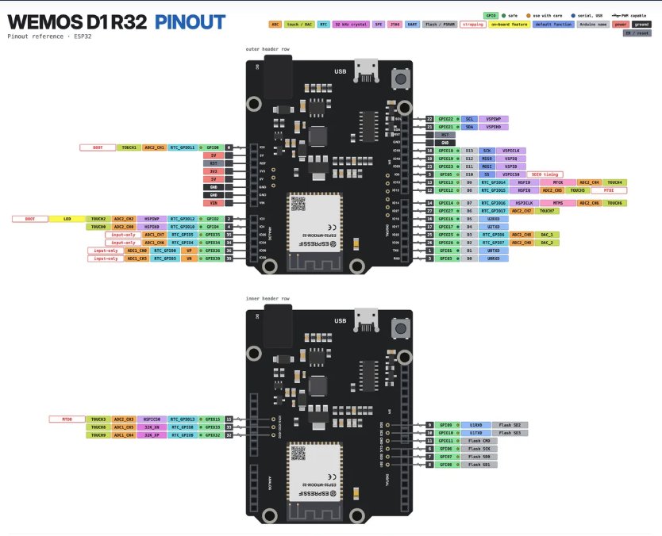
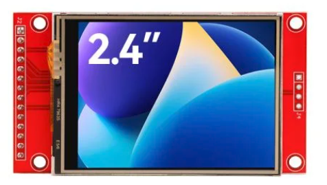
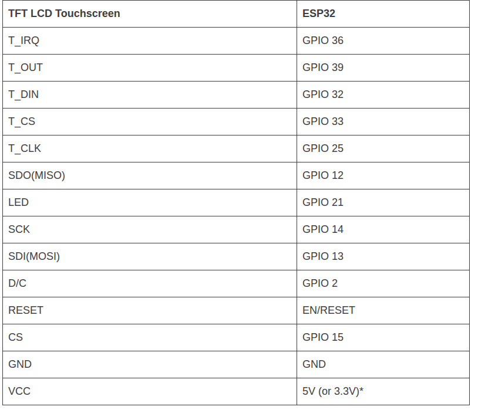

# PROJECT: TFT LCD SCREEN ON A ESP32 BOARD
This project demonstrates how to interface a TFT LCD screen with an ESP32 board. The goal is to find any thing fun to put on this lcd screen.

# ABOUT COMPONENTS:
## BOARD I USED IN THIS PROJECT: WEMOS D1 R32



## 2.4' TFT SPI 240x320 



# Pin in/out:



# BUILD
1 Download the TFT_eSPI and XPT2046 libraries from the Arduino Library Manager for my manual pin setup.
2 Install platformIO on vscode or run the Arduino IDE ( your choice ). I choose platformIO.
3 Put 2 folder TFT_eSPI and XPT2046 you have download from my repo to the /lib folder of your project.
4 Choice what you want to run or look at my main.cpp and other files to see what I have done. I have a few examples of what you can do with this screen.

# What I have learn about this screen:
-  First, this shit have touch sensor, so you can use as a touch screen with the XPT2046 lib you have downloaded.
```c++
if (touchscreen.touched()) {
    // Get Touchscreen points

    TS_Point p = touchscreen.getPoint();
    // Calibrate Touchscreen points with map function to the correct width and height
    x = map(p.x, 200, 3700, 1, SCREEN_WIDTH);
    y = map(p.y, 240, 3800, 1, SCREEN_HEIGHT);
    z = p.z;

    // your code
}
```

2. Use sprite to increase the fps, using tft.fillScreen will take alot of time to do, it render each pixel and show it at the time it render and that can make other object broken when increase the fps, so I use sprite to draw on memory first and push the Sprite to the screen at the time to increase quality and fps.